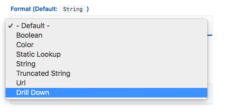
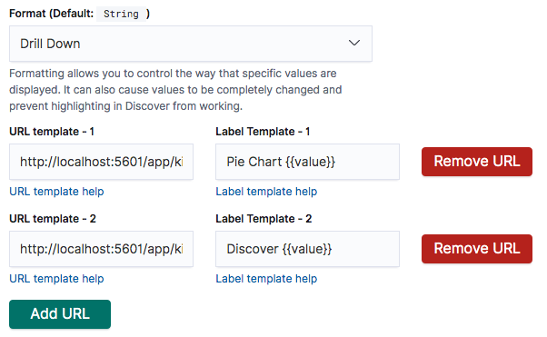
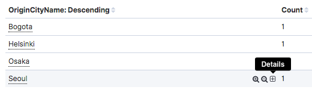

# kibana-plugin-drilldownmenu
> Drill down menu implementation for Kibana

## Installation:

- Clone this repository
- Rename cloned folder to `kibana-plugin-drilldownmenu`
- Create another folder named `kibana`
- Copy `kibana-plugin-drilldownmenu` folder into newly created folder `kibana`
```.
├── kibana
│   ├── kibana-plugin-drilldownmenu
│   │   ├── [repository-content]
│   │   ├── .
│   │   ├── .
│   │   ├── .
```
- Compress `kibana` into `kibana.zip`
- Install plugin into kibana with:
```
./kibana-plugin install file://[PATH-TO-ZIP]
```

## Usage:

- Change field format under kibana's Index Patterns to **Drill Down**

- Configure URL's and labels that should be present in the menu

- Hovering over values of the formatted field displays configured menu




